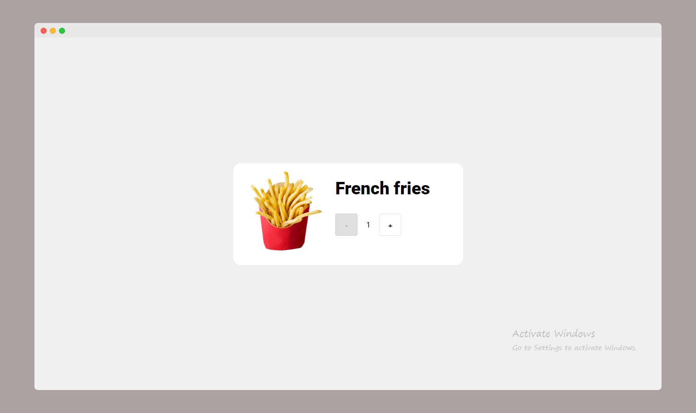

# Counter (image)

This is a simple web-based counter application designed for tracking quantities of an item, represented visually with an image. In this project, the item displayed is **French fries**, and the user can increase or decrease the quantity using buttons.

## Features

- Displays an image of an item (e.g., French fries) with a counter interface.
- Users can increase or decrease the quantity of the item using "+" and "-" buttons.
- Real-time display of the current count.
- Simple and clean UI.

## Screenshot

<div align="center">
    
</div>

## Technologies Used

- **HTML**: For structuring the user interface.
- **CSS**: For styling the application.
- **React**: For dynamic counter functionality.

## Getting Started

### Prerequisites

- Ensure you have Node.js installed (if React is being used).

### Installation

1. Clone the repository:

    ```bash
    git clone https://github.com/pratyush0898/counter.git
    ```

2. Navigate to the project folder:

    ```bash
    cd counter
    ```

3. Install dependencies:

    ```bash
    npm install
    ```

4. Start the development server:

    ```bash
    npm run dev
    ```

### Usage

- Once the app is running, you'll see a web page with an image of **French fries** and a counter.
- Use the "+" button to increase the count and the "-" button to decrease it.
